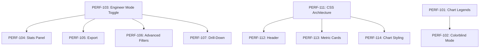

# JIRA Work Breakdown - Performance Engineering Dashboard

**Date**: December 4, 2025  
**Status**: Planning  
**Document Type**: Project Planning / JIRA Structure

---

## Executive Summary

This document outlines the remaining work for the Performance Engineering Dashboard, organized as a JIRA hierarchy with the Dashboard as the Feature at the top level, broken down into Stories and Tasks.

---

## JIRA Hierarchy Structure

```
🏔️ Feature
  └── 📋 Story
        └── ✅ Task / Sub-task
```

---

## Feature: RHEL Multi Arch Performance Engineering Dashboard

**Feature ID**: PERF-100  
**Priority**: High  
**Description**: A Python Dash dashboard for visualizing software performance benchmark results from OpenSearch. Track performance regressions across OS versions, compare against peer operating systems, and analyze cloud scaling behavior.

---

## Stories

### Story 1: Add Chart Legends/Keys
**Story ID**: PERF-101  
**Points**: 5  
**Category**: Accessibility  
**Description**: Add clear legends and keys to help users understand chart elements, color coding, and data representation.

| Task ID | Task | Points | Notes |
|---------|------|--------|-------|
| PERF-101-1 | Add legend to regression bar charts explaining color coding (red=regression, green=improvement, gray=stable) | 2 | `visualizations.py` |
| PERF-101-2 | Add legend to peer OS comparison chart explaining relative performance scale | 2 | Show 100% baseline meaning |
| PERF-101-3 | Add legend to cloud scaling chart explaining ideal linear scaling line | 1 | Dashed line explanation |
| PERF-101-4 | Add legend to heatmaps explaining color scale interpretation | 2 | Include % change ranges |
| PERF-101-5 | Create reusable legend component for consistent styling | 3 | `src/components/legends.py` |
| PERF-101-6 | Add help tooltips (?) next to chart titles with interpretation guidance | 2 | Bootstrap popovers |

**Acceptance Criteria**:
- All charts have visible legends explaining color meanings
- Legends are positioned consistently (bottom or right of chart)
- Help tooltips provide context for non-expert users
- Legends don't obscure chart data

---

### Story 2: Implement Colorblind Mode
**Story ID**: PERF-102  
**Points**: 8  
**Category**: Accessibility  
**Description**: Add colorblind-friendly color palettes and visual patterns to ensure charts are accessible to users with color vision deficiencies.

| Task ID | Task | Points | Notes |
|---------|------|--------|-------|
| PERF-102-1 | Research and select colorblind-safe palette (e.g., Viridis, Cividis, or custom) | 2 | Consider deuteranopia, protanopia, tritanopia |
| PERF-102-2 | Create colorblind mode toggle in header settings | 2 | Persist preference like dark mode |
| PERF-102-3 | Implement alternative color scales for regression charts | 3 | Replace red/green with blue/orange |
| PERF-102-4 | Add pattern fills (hatching, dots) to bar charts for redundant encoding | 3 | Plotly pattern support |
| PERF-102-5 | Update heatmap color scales for colorblind accessibility | 2 | Use sequential single-hue or diverging colorblind-safe |
| PERF-102-6 | Add shape markers to line charts (circle, square, triangle) | 2 | Redundant encoding |
| PERF-102-7 | Update CSS for colorblind-safe status indicators | 2 | Icons + colors |
| PERF-102-8 | Create `assets/colorblind-theme.css` for UI element adjustments | 2 | Badges, alerts, borders |
| PERF-102-9 | Add colorblind mode documentation | 1 | `docs/guides/ACCESSIBILITY.md` |

**Acceptance Criteria**:
- Toggle available in header (near dark mode toggle)
- All charts readable with deuteranopia, protanopia simulations
- Preference persists in localStorage
- Patterns/shapes provide redundant encoding beyond color
- Passes WCAG 2.1 AA color contrast requirements

---

### Story 3: Engineer Mode Toggle & Infrastructure
**Story ID**: PERF-103  
**Points**: 5  
**Category**: Engineer Mode  
**Description**: Create the toggle mechanism and infrastructure for switching between standard and engineer modes.

| Task ID | Task | Points | Notes |
|---------|------|--------|-------|
| PERF-103-1 | Add Engineer Mode toggle to header (gear icon or switch) | 2 | Persist in localStorage |
| PERF-103-2 | Create `dcc.Store` for engineer mode state | 1 | Share across callbacks |
| PERF-103-3 | Add conditional rendering logic for mode-specific components | 2 | Show/hide based on mode |
| PERF-103-4 | Create engineer mode indicator badge in header | 1 | Visual confirmation |

**Acceptance Criteria**:
- Clear toggle mechanism in header
- Mode persists across sessions
- Visual indicator when engineer mode is active

---

### Story 4: Statistical Analysis Panel
**Story ID**: PERF-104  
**Points**: 8  
**Category**: Engineer Mode  
**Depends On**: PERF-103  
**Description**: Add detailed statistical analysis including confidence intervals, p-values, and statistical significance testing.

| Task ID | Task | Points | Notes |
|---------|------|--------|-------|
| PERF-104-1 | Add confidence interval display to comparison charts | 3 | 95% CI error bars |
| PERF-104-2 | Implement t-test for version comparisons with p-value display | 3 | scipy.stats |
| PERF-104-3 | Add statistical significance indicators (*, **, ***) | 2 | p < 0.05, 0.01, 0.001 |
| PERF-104-4 | Create expandable statistics panel below charts | 3 | Mean, median, std, quartiles |
| PERF-104-5 | Add sample size (n) display for each comparison | 1 | Important for validity |
| PERF-104-6 | Implement effect size calculation (Cohen's d) | 2 | Practical significance |

**Acceptance Criteria**:
- Statistical tests run automatically when comparing versions
- P-values and effect sizes clearly displayed
- Confidence intervals visible on charts
- Sample sizes shown for context

---

### Story 5: Raw Data Access & Export
**Story ID**: PERF-105  
**Points**: 5  
**Category**: Engineer Mode  
**Depends On**: PERF-103  
**Description**: Provide access to raw data tables and export functionality for offline analysis.

| Task ID | Task | Points | Notes |
|---------|------|--------|-------|
| PERF-105-1 | Add "View Raw Data" expandable section per analysis | 2 | AG Grid with sorting/filtering |
| PERF-105-2 | Implement CSV export for filtered data | 2 | Download button |
| PERF-105-3 | Implement JSON export for programmatic access | 2 | Full data structure |
| PERF-105-4 | Add "Copy to Clipboard" for quick data sharing | 1 | Formatted table |
| PERF-105-5 | Create export options modal (format, fields, date range) | 3 | Customizable export |

**Acceptance Criteria**:
- Raw data accessible for each analysis section
- Multiple export formats (CSV, JSON)
- Export respects current filters
- Large datasets handled efficiently

---

### Story 6: Advanced Filtering & Query Builder
**Story ID**: PERF-106  
**Points**: 8  
**Category**: Engineer Mode  
**Depends On**: PERF-103  
**Description**: Provide advanced filtering capabilities including custom queries and saved filter presets.

| Task ID | Task | Points | Notes |
|---------|------|--------|-------|
| PERF-106-1 | Add regex filter support for test names | 3 | Pattern matching |
| PERF-106-2 | Implement metric threshold filters (e.g., "show only >10% regression") | 3 | Numeric comparisons |
| PERF-106-3 | Create saved filter presets functionality | 5 | Save/load/delete presets |
| PERF-106-4 | Add "exclude" option for filters (e.g., exclude specific tests) | 2 | Inverse selection |
| PERF-106-5 | Implement filter history (recent filters) | 2 | Quick access |

**Acceptance Criteria**:
- Advanced filters only visible in engineer mode
- Presets persist across sessions
- Complex filter combinations supported
- Clear indication of active filters

---

### Story 7: Detailed Metrics & Drill-Down
**Story ID**: PERF-107  
**Points**: 8  
**Category**: Engineer Mode  
**Depends On**: PERF-103  
**Description**: Enhanced drill-down capabilities with detailed per-run metrics and comparison tools.

| Task ID | Task | Points | Notes |
|---------|------|--------|-------|
| PERF-107-1 | Expand investigation view with all available metrics | 3 | Not just primary metric |
| PERF-107-2 | Add per-run details table with full metadata | 3 | Job ID, timestamp, config |
| PERF-107-3 | Implement run-to-run comparison selector | 5 | Pick specific runs to compare |
| PERF-107-4 | Add histogram/distribution view for metric values | 3 | Beyond box plots |
| PERF-107-5 | Show outlier analysis with automatic detection | 3 | IQR-based flagging |

**Acceptance Criteria**:
- All metrics accessible (not just primary)
- Individual runs selectable for comparison
- Outliers clearly identified
- Full test metadata visible

---

### Story 8: Cloud Scaling Analysis Improvements
**Story ID**: PERF-108  
**Points**: 5  
**Category**: Cloud Scaling  
**Description**: Enhance the cloud scaling analysis logic and data processing.

| Task ID | Task | Points | Notes |
|---------|------|--------|-------|
| PERF-108-1 | Improve instance size ordering logic (small → medium → large → xlarge) | 3 | Parse instance names |
| PERF-108-2 | Add CPU core extraction from instance metadata | 2 | For scaling calculations |
| PERF-108-3 | Calculate scaling efficiency metric (actual vs ideal) | 3 | Percentage of linear |
| PERF-108-4 | Add memory-based scaling analysis | 3 | Memory-bound workloads |
| PERF-108-5 | Implement cross-cloud comparison for same workload | 5 | AWS vs Azure vs GCP |

**Acceptance Criteria**:
- Instance sizes correctly ordered
- Scaling efficiency calculated and displayed
- Multiple scaling dimensions (CPU, memory)

---

### Story 9: Cloud Scaling Visualizations
**Story ID**: PERF-109  
**Points**: 8  
**Category**: Cloud Scaling  
**Description**: Create comprehensive visualizations for cloud scaling analysis.

| Task ID | Task | Points | Notes |
|---------|------|--------|-------|
| PERF-109-1 | Add ideal linear scaling reference line to charts | 2 | Visual comparison |
| PERF-109-2 | Create scaling efficiency heatmap (benchmark × instance size) | 5 | Color-coded efficiency |
| PERF-109-3 | Add cost-performance scatter plot (if cost data available) | 5 | Value analysis |
| PERF-109-4 | Implement multi-benchmark scaling comparison | 3 | Overlay multiple benchmarks |
| PERF-109-5 | Add scaling summary cards (best/worst scaling benchmarks) | 3 | Quick insights |

**Acceptance Criteria**:
- Clear visualization of scaling behavior
- Easy identification of sub-linear scaling
- Comparison across benchmarks possible

---

### Story 10: Cloud Provider Comparison
**Story ID**: PERF-110  
**Points**: 5  
**Category**: Cloud Scaling  
**Description**: Add cross-cloud provider comparison capabilities.

| Task ID | Task | Points | Notes |
|---------|------|--------|-------|
| PERF-110-1 | Create cloud provider comparison chart (same instance class) | 5 | Normalize by CPU/memory |
| PERF-110-2 | Add cloud-specific insights panel | 3 | Best performer per workload |
| PERF-110-3 | Implement cloud recommendation engine | 5 | Suggest optimal cloud for workload |

**Acceptance Criteria**:
- Fair comparison across clouds (normalized)
- Clear winner identification per benchmark
- Actionable recommendations

---

### Story 11: CSS Architecture & Design System
**Story ID**: PERF-111  
**Points**: 5  
**Category**: UI Modernization  
**Description**: Establish the CSS architecture and design system foundation.

| Task ID | Task | Points | Notes |
|---------|------|--------|-------|
| PERF-111-1 | Create CSS custom properties (variables) for colors, spacing, typography | 3 | `:root` variables |
| PERF-111-2 | Implement spacing utility classes | 2 | Consistent margins/padding |
| PERF-111-3 | Create typography scale and font loading | 2 | Inter/JetBrains Mono |
| PERF-111-4 | Organize CSS into modular files | 3 | components/, utilities/ |

**Acceptance Criteria**:
- CSS variables used consistently
- Design tokens documented
- Modular CSS structure

---

### Story 12: Header & Navigation Redesign
**Story ID**: PERF-112  
**Points**: 5  
**Category**: UI Modernization  
**Depends On**: PERF-111  
**Description**: Modernize the header with improved visual hierarchy and quick filters.

| Task ID | Task | Points | Notes |
|---------|------|--------|-------|
| PERF-112-1 | Implement gradient background header | 2 | Subtle depth |
| PERF-112-2 | Add status badges (record count, last update) | 2 | At-a-glance info |
| PERF-112-3 | Create quick filter bar below header | 3 | Common filters inline |
| PERF-112-4 | Add export button to header | 2 | Quick access |

**Acceptance Criteria**:
- Header visually distinct and professional
- Key information visible at a glance
- Quick filters reduce clicks

---

### Story 13: Summary Metric Cards
**Story ID**: PERF-113  
**Points**: 5  
**Category**: UI Modernization  
**Depends On**: PERF-111  
**Description**: Add key metrics overview cards below the header.

| Task ID | Task | Points | Notes |
|---------|------|--------|-------|
| PERF-113-1 | Create metric card component | 3 | Reusable, animated |
| PERF-113-2 | Implement 4-card metrics row (Total Tests, Regressions, Pass Rate, Clouds) | 3 | Dynamic values |
| PERF-113-3 | Add hover effects and loading states | 2 | Polish |
| PERF-113-4 | Implement click-to-filter on cards | 3 | Interactive |

**Acceptance Criteria**:
- Key metrics visible immediately
- Cards update with filter changes
- Visually appealing with animations

---

### Story 14: Chart Styling Consistency
**Story ID**: PERF-114  
**Points**: 5  
**Category**: UI Modernization  
**Depends On**: PERF-111  
**Description**: Apply consistent Plotly theme across all charts.

| Task ID | Task | Points | Notes |
|---------|------|--------|-------|
| PERF-114-1 | Create custom Plotly template with brand colors | 3 | `pio.templates` |
| PERF-114-2 | Standardize hover labels across all charts | 2 | Consistent formatting |
| PERF-114-3 | Implement consistent axis styling | 2 | Grid, labels, titles |
| PERF-114-4 | Add chart loading skeletons | 3 | Better UX during load |

**Acceptance Criteria**:
- All charts share consistent visual language
- Hover interactions uniform
- Loading states professional

---

### Story 15: Expand Unit Test Coverage
**Story ID**: PERF-115  
**Points**: 5  
**Category**: Testing & QA  
**Description**: Increase unit test coverage for data processing and analysis functions.

| Task ID | Task | Points | Notes |
|---------|------|--------|-------|
| PERF-115-1 | Add tests for RHEL regression analysis edge cases | 3 | Empty data, single version |
| PERF-115-2 | Add tests for peer OS comparison logic | 3 | Missing OS, no common HW |
| PERF-115-3 | Add tests for cloud scaling calculations | 2 | Various instance types |
| PERF-115-4 | Add tests for filter combinations | 3 | Multi-select, date ranges |
| PERF-115-5 | Add visualization function tests | 3 | Empty data, edge cases |

**Acceptance Criteria**:
- Test coverage > 80%
- All edge cases covered
- Tests run in CI

---

### Story 16: Integration & E2E Testing
**Story ID**: PERF-116  
**Points**: 8  
**Category**: Testing & QA  
**Description**: Implement integration and end-to-end tests for the dashboard.

| Task ID | Task | Points | Notes |
|---------|------|--------|-------|
| PERF-116-1 | Set up Selenium/Playwright for E2E testing | 5 | Browser automation |
| PERF-116-2 | Create E2E test for filter → chart update flow | 3 | Full callback chain |
| PERF-116-3 | Create E2E test for investigation drill-down | 3 | Navigation flow |
| PERF-116-4 | Add visual regression testing | 5 | Screenshot comparison |

**Acceptance Criteria**:
- E2E tests cover critical user flows
- Tests run in CI pipeline
- Visual regressions caught automatically

---

## Summary by Category

| Category | Stories | Total Points |
|----------|---------|--------------|
| Accessibility | PERF-101, PERF-102 | 13 |
| Engineer Mode | PERF-103, PERF-104, PERF-105, PERF-106, PERF-107 | 34 |
| Cloud Scaling | PERF-108, PERF-109, PERF-110 | 18 |
| UI Modernization | PERF-111, PERF-112, PERF-113, PERF-114 | 20 |
| Testing & QA | PERF-115, PERF-116 | 13 |
| **Total** | **16 Stories** | **98 Points** |

---

## Priority Order

### Phase 1 (Immediate - High Priority)
1. **PERF-101**: Add Chart Legends/Keys - *User-facing, quick wins*
2. **PERF-102**: Colorblind Mode - *Accessibility requirement*
3. **PERF-103**: Engineer Mode Toggle - *Enables advanced features*

### Phase 2 (Short-term - Medium Priority)
4. **PERF-108**: Cloud Scaling Analysis Improvements - *Complete existing section*
5. **PERF-104**: Statistical Analysis Panel - *High value for engineers*
6. **PERF-105**: Raw Data Export - *Frequently requested*

### Phase 3 (Medium-term)
7. **PERF-111**: CSS Architecture - *Foundation for UI work*
8. **PERF-112, PERF-113, PERF-114**: UI Modernization - *Visual polish*
9. **PERF-115, PERF-116**: Testing & QA - *Maintain quality*

### Phase 4 (Future)
10. **PERF-106**: Advanced Filtering - *Power user features*
11. **PERF-107**: Detailed Drill-Down - *Deep analysis*
12. **PERF-109, PERF-110**: Advanced Cloud Scaling - *Extended analysis*

---

## Estimation Summary

| Metric | Value |
|--------|-------|
| Total Stories | 16 |
| Total Points | 98 |
| Estimated Sprints (10 pts/sprint) | ~10 sprints |

---

## Dependencies



---

## Labels & Components

**Suggested Labels**:
- `accessibility`
- `engineer-mode`
- `cloud-scaling`
- `ui`
- `testing`

**Suggested Components**:
- `frontend`
- `data-processing`
- `visualization`
- `infrastructure`

---

## Notes for JIRA Import

1. **Feature Link**: All Stories should link to Feature PERF-100
2. **Dependencies**: Use "Depends On" field for stories with prerequisites
3. **Categories**: Use labels to group related stories
4. **Sprint Planning**: Consider dependencies when scheduling
5. **Acceptance Criteria**: Copy from this document to JIRA stories

---

**Document Maintainer**: Performance Engineering Team  
**Last Updated**: December 4, 2025
