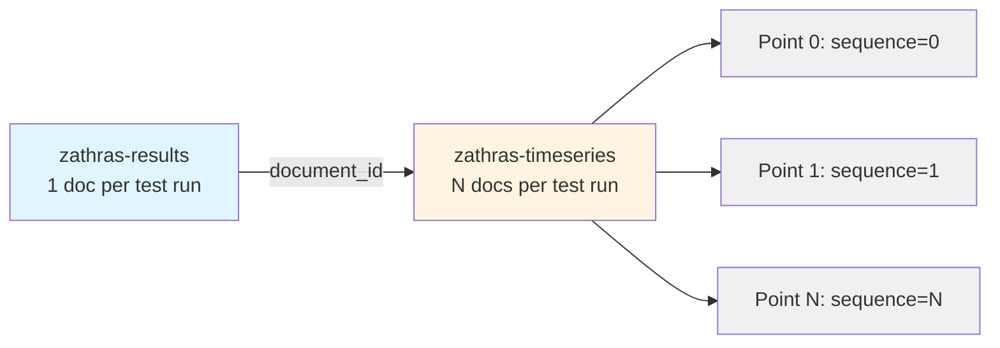
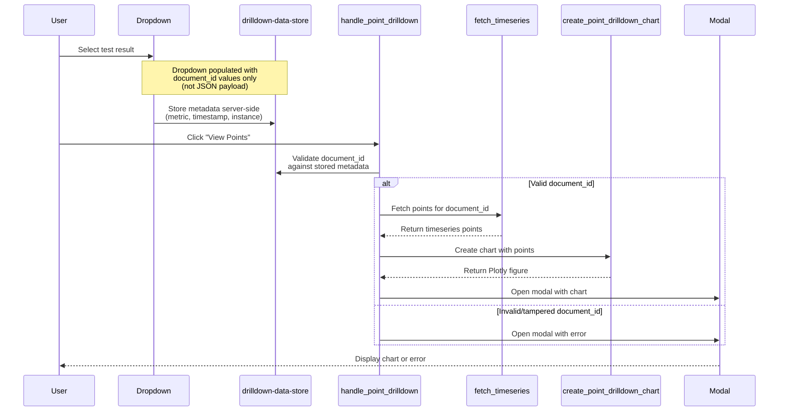

# Point Drill-Down Feature Guide

**Status**: Active  
**Related**: [SCHEMA.md](SCHEMA.md), [OPENSEARCH_CONNECTION_GUIDE.md](OPENSEARCH_CONNECTION_GUIDE.md)  
**Ticket**: RPOPC-1183, RPOPC-1184

## Overview

The point drill-down feature allows users to view granular, point-level timeseries data for individual benchmark test runs from the Investigation view. When viewing a specific test result in Investigate mode, users can select a result and click "View Points" to see a detailed chart of all individual iteration points that contributed to the summary metrics.

**Use cases:**
- Analyzing run-to-run variance within a single test execution
- Identifying outliers or anomalies in iteration data
- Understanding the distribution of performance across multiple iterations
- Debugging unexpected summary statistics by examining raw points

## Architecture

### Two-Index Data Model

The dashboard uses a two-index architecture to separate summary-level data from point-level detail:

**Linking mechanism**: Each timeseries document has `metadata.document_id` matching the parent result's `metadata.document_id` (field value, not OpenSearch `_id`).

### Point Drill-Down Flow

## UI Components

### Point Drill-Down Dropdown

**Location**: Investigation view, below the main comparison chart  
**Purpose**: Select which test result to drill into

**Behavior**:
- Populated with up to 50 most recent test results from the current investigation view
- Each option shows: test name, timestamp, instance type, cloud provider
- Only includes results with numeric primary metric values
- Dropdown value is a simple `document_id` string (security: not a JSON payload)

**Required columns** (dropdown is empty if any are missing):
- `document_id`
- `primary_metric_name`
- `primary_metric_value` (must be numeric)
- `primary_metric_unit`
- `timestamp`
- `instance_type`
- `cloud_provider`

### View Points Button

**Label**: "View Points"  
**Behavior**: Opens modal with timeseries chart for selected document

### Point Drill-Down Modal

**Title format**: `Points for {test_name} - {timestamp} ({instance_type}, {cloud_provider})`

**Body**: Plotly line chart showing:
- X-axis: Sequence number (0, 1, 2, ...)
- Y-axis: Metric value
- Dashed horizontal line: Summary value (reference)
- Colorblind mode support: uses distinct marker symbols when enabled

**Footer**: Optional "View in OpenSearch Discover" link (if OpenSearch Dashboards URL configured and timeseries_id available)

## Data Flow

### Dropdown Population (`update_investigation_view` callback)

**Source**: The `update_investigation_view` function in `app.py`

1. Filter investigation DataFrame for required columns
2. Skip rows with NaN `document_id` or non-numeric `primary_metric_value`
3. Sort by timestamp descending, take top 50
4. Build `drilldown_data` dict: `{document_id: {metric_name, metric_unit, summary_value, timestamp, instance_type, cloud_provider}}`
5. Store `drilldown_data` in `dcc.Store` (server-side metadata)
6. Return dropdown options with `document_id` as value

**Security note**: Dropdown uses simple `document_id` values, not JSON payloads. Metadata is stored server-side in `drilldown_data`.

### Point Drill-Down Request (`handle_point_drilldown` callback)

**Source**: The `handle_point_drilldown` function in `app.py`

**Validation** (the `validate_point_drilldown_request` function):
1. Reject None or empty `document_id`
2. Reject None or empty `drilldown_data`
3. Reject `document_id` not in `drilldown_data` (prevents client-side tampering)
4. Extract metadata from `drilldown_data` for validated `document_id`

**Fetch** (dual-mode support):
- **Synthetic mode**: `fetch_synthetic_timeseries_for_document(document_id)` from `src.data_processing`
- **OpenSearch mode**: `BenchmarkDataSource().fetch_timeseries_for_document(document_id)` from `src.opensearch_client`

**Error handling**:
- Logs exceptions server-side with full traceback (`exc_info=True`)
- Returns sanitized generic error to UI: "Failed to load timeseries data. Please try again or contact support."
- No sensitive details (IPs, ports, credentials, internal paths) leaked to user

**Chart creation**:
- Extracts `metadata.sequence` and `results.point_metrics[metric_name]` from each point
- Falls back to first available metric if requested metric not found (annotates chart)
- Handles None metadata gracefully (uses `or {}` pattern)
- Adds dashed reference line for summary value

## Dual-Mode Support

### Synthetic Mode

**Data source**: `data/synthetic/zathras_timeseries.json.gz`

**Loading**: Lazy-loaded via singleton pattern on first request (not at startup)
- `load_synthetic_timeseries()` builds index: `Dict[document_id, List[point_dict]]`
- `get_synthetic_timeseries_index()` returns cached index
- `fetch_synthetic_timeseries_for_document(document_id, size=10000)` returns points for document

**Characteristics**:
- ~45,000 timeseries points across ~1,700 sequences
- 80% short sequences (10-20 points), 20% long sequences (50-100 points)
- 30-second intervals between points
- Realistic variance (2-8% stddev, clamped to ±20%)

### OpenSearch Mode

**Data source**: `zathras-timeseries` index

**Query**: Term match on `metadata.document_id`, sorted by `metadata.sequence` ascending

**Size limit**: 10,000 points (warns if result count equals limit)

**Configuration**:
- Requires `OPENSEARCH_INDEX_TIMESERIES` environment variable
- Optional `OPENSEARCH_DASHBOARDS_BASE_URL` for "View in Discover" links

## Security Considerations

### 1. Dropdown Uses Simple Document IDs (Not JSON)

**Threat**: Client could send arbitrary JSON payload with tampered metadata

**Mitigation**: Dropdown value is a simple `document_id` string. All metadata (metric name, unit, summary value, instance, cloud) is stored server-side in `drilldown_data` store.

**Code reference**: The dropdown construction logic in the `update_investigation_view` function in `app.py`

### 2. Server-Side Validation

**Threat**: Client sends `document_id` not in the filtered investigation data

**Mitigation**: The `validate_point_drilldown_request` function checks `document_id` against `drilldown_data` dict. Rejects any `document_id` not present.

**Code reference**: The `validate_point_drilldown_request` function in `app.py`

**Test coverage**: `tests/test_investigate_drilldown.py::test_handle_point_drilldown_validates_document_id_against_drilldown_data`

### 3. Exception Sanitization

**Threat**: OpenSearch exceptions leak internal IPs, ports, credentials, or stack traces

**Mitigation**:
- Exceptions logged server-side with full details for debugging
- Generic error returned to UI: "Failed to load timeseries data. Please try again or contact support."
- No exception message, traceback, or internal details in user-facing output

**Code reference**: The exception handling blocks in the `handle_point_drilldown` function in `app.py`

**Test coverage**:
- `tests/test_investigate_drilldown.py::test_handle_point_drilldown_sanitizes_exceptions`
- `tests/test_investigate_drilldown.py::test_handle_point_drilldown_opensearch_mode_error_sanitized`

## Chart Details

### Visualization (`create_point_drilldown_chart`)

**Source**: The `create_point_drilldown_chart` function in `src/components/visualizations.py`

**Data extraction**:
- X-axis: `metadata.sequence` from each point (0, 1, 2, ...)
- Y-axis: `results.point_metrics[metric_name]` for requested metric
- Fallback: If requested metric not in `point_metrics`, uses first available metric and adds annotation

**Reference line**:
- Dashed horizontal line at `summary_value` (from result document's summary metric)
- Labeled as "Summary"

**Colorblind mode**:
- When enabled, uses distinct marker symbols (circles, squares, triangles) in addition to colors
- Controlled by `colorblind_mode` parameter passed from user preferences

**Error cases**:
- Empty points list: Returns empty figure
- No metric values found: Returns empty figure
- None metadata: Handled gracefully via `or {}` pattern (doesn't crash)

### Chart Customization

**Title**: Auto-generated from metadata (timestamp, instance, cloud)

**X-axis**: "Sequence Number"

**Y-axis**: `{metric_name} ({metric_unit})`

**Legend**: Shows "Points" trace and "Summary" reference line

**Hover**: Shows sequence number, metric value, and metric name

## Example Usage

### Typical Workflow

1. Navigate to Investigation view (select test, baseline/comparison versions)
2. View shows aggregated comparison chart
3. Below chart, select a specific test result from "Point Drill-Down" dropdown
4. Click "View Points" button
5. Modal opens with detailed timeseries chart showing all iteration points
6. Analyze variance, outliers, or distribution
7. Optionally click "View in OpenSearch Discover" to see raw data
8. Close modal to return to Investigation view

### Interpreting the Chart

**Tight clustering around reference line**: Low variance, consistent performance  
**Wide spread**: High variance, investigate environmental factors or test stability  
**Outliers**: Identify anomalous iterations, possible cold-start or external interference  
**Trend within sequence**: May indicate warm-up period or degradation over time

## Troubleshooting

### Dropdown is Empty

**Causes**:
- No results in current investigation view
- Missing required columns (`document_id`, `primary_metric_value`, etc.)
- All `primary_metric_value` entries are non-numeric

**Fix**: Verify investigation view has results with valid numeric primary metrics

### "No point-level data found"

**Causes**:
- Result document has no timeseries data in `zathras-timeseries` index
- Document is from a test type that doesn't generate timeseries
- In synthetic mode: `document_id` not in `zathras_timeseries.json.gz`

**Fix**: Not all test results have timeseries data. Only results with multiple iterations generate timeseries.

### "Failed to load timeseries data"

**Causes**:
- OpenSearch connection error
- Timeseries index not configured (`OPENSEARCH_INDEX_TIMESERIES` missing)
- Network timeout

**Fix**: Check OpenSearch connection, verify timeseries index exists and is accessible

## Related Documentation

- [SCHEMA.md](SCHEMA.md#timeseries-index-schema) - Timeseries index structure and field definitions
- [OPENSEARCH_CONNECTION_GUIDE.md](OPENSEARCH_CONNECTION_GUIDE.md#two-index-model-zathras-production) - Two-index model explanation
- [CATEGORY_NAVIGATION.md](CATEGORY_NAVIGATION.md) - Category-level drill-down (different feature)
